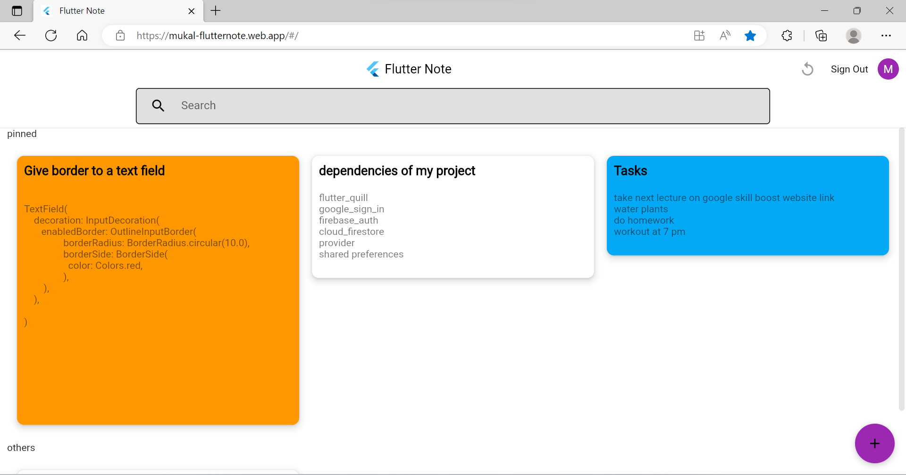
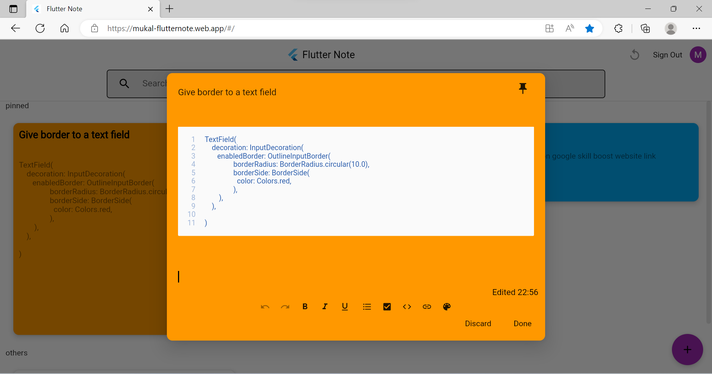
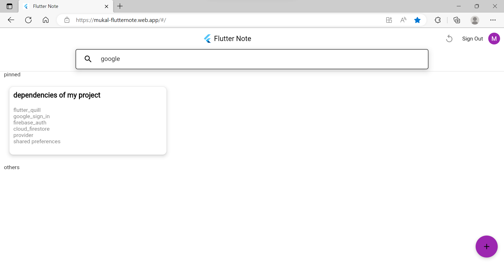
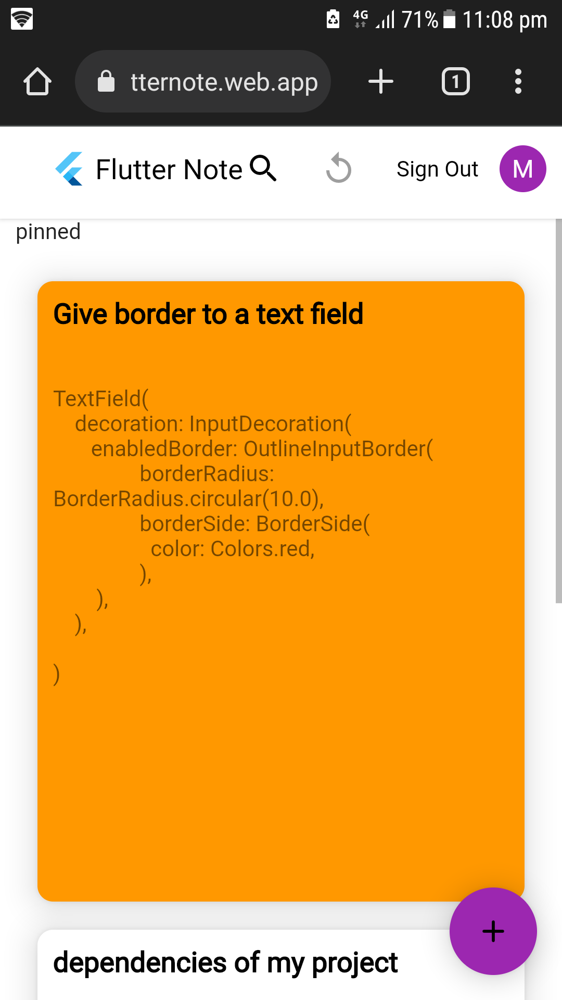

# Flutter Note📒- A webapp to store your programming notes!

It is build on top of flutter, firebase and dart. Users can create and store their notes which can include text, tasks, code snippets, links and bullet points.The notes are stored inside firebase firestore. Authentication is provided using google oauth client and firebase auth.

visit this [link](https://mukal-flutternote.web.app/#/) to use the live hosted website(hosted using firebase hosting)

## Libraries Used
***

```flutter_quill``` - for creating a text editor where users write their notes.

```firebase_core & firebase_auth``` - for connecting firebase and providing authentication.

```cloud_firestore``` - for storing the notes as documents inside firestore database where collection is associated with each user.

```google_sign_in``` - for creating sign in dialog and logging in the user using his google acccount.

```shared_preferences``` - to save the data of signed in user and auto logging in when the user opens the page again. Authentication session don't persist on web(something i learnt while creating this project).


```provider``` - to store the notes of user in a list and provide it to the complete application.

```flutter_staggered_grid_view``` - for creating a grid of notes.

```flutter_colorpicker``` - to create a dialog and give background color to a note.

## Screenshots
***

desktop







mobile



</br>

## Thanks for viewing
***

> Feel free to reach out to me on github or mail mukaldadhwal@gmail.com. Thanks You Very Much😄!!